````md
#  Finance Voice Agent (LangGraph + GenAI)


---

## Overview

An AI-powered finance assistant that safely logs and analyzes expenses using a hybrid architecture combining LLM reasoning with deterministic backend control.

This system addresses a key challenge in real-world AI applications:

> How do you use LLMs without risking incorrect or unsafe data operations?

**Solution:**  
Use LLMs for interpretation and reasoning, while keeping all critical operations deterministic and verifiable.

---

##  Why This Project Matters

Most AI agents:
- rely heavily on LLMs  
- lack control over data integrity  
- are not production-safe  

This project demonstrates how to:
- safely integrate LLMs into financial workflows  
- prevent hallucinated or incorrect data writes  
- build observable, debuggable AI systems  

---

##  Key Features

-  Voice + text-based expense tracking  
-  LLM-powered intent classification and structured extraction  
-  Strict validation layer before any database write  
-  Multi-step workflow orchestration using LangGraph  
-  Expense summaries and category breakdowns  
-  AI-generated financial insights  
-  Clarification handling for incomplete inputs  
- Execution path tracing for full transparency  
-  Unit + workflow-level testing  

---

##  Example Workflow

### User Input
> “I spent $25 on lunch today”

### System Execution
1. Transcribe (if voice input)  
2. Classify intent → `log_expense`  
3. Extract structured data  
   ```json
   { "amount": 25, "category": "food" }
````

4. Validate schema + constraints
5. Store in database (Notion)
6. Respond to user

### Output

> “Logged $25 under Food”

---

##  Architecture



### Flow Summary

```
User Input (Voice/Text)
        ↓
   Transcribe
        ↓
   Classify Intent
      ↙       ↘
 Log Expense   Fetch Summary
      ↓             ↓
   Extract       Retrieve Data
      ↓             ↓
   Validate      Analyze (LLM)
      ↓             ↓
   Store         Respond
        ↓
     Respond
```

---

##  System Design Snapshot

| Layer            | Responsibility                    |
| ---------------- | --------------------------------- |
| LLM Layer        | Intent classification, extraction |
| Control Layer    | Workflow routing (LangGraph)      |
| Validation Layer | Data integrity enforcement        |
| Storage Layer    | Notion database                   |
| API Layer        | FastAPI endpoints                 |

---

##  Key Design Decisions

### Hybrid Architecture (Deterministic + AI)

**Deterministic components handle:**

* validation
* database operations
* workflow control

**LLMs handle:**

* intent classification
* structured extraction
* insight generation

> “Use LLMs for uncertainty, not for certainty.”

---

### Multi-Stage Decision Making

Routing occurs at multiple points:

* After classification → choose workflow
* After data retrieval → decide whether to analyze

This ensures correct handling of data dependencies and flow control.

---

##  Production Considerations

* Prevents invalid writes via strict validation layer
* Minimizes hallucinations by limiting LLM responsibilities
* Uses deterministic fallbacks for critical operations
* Provides execution tracing for debugging and observability
* Separates concerns between AI reasoning and system logic

---

##  Tech Stack

* LangGraph → workflow orchestration
* FastAPI → backend API
* Streamlit → frontend UI
* OpenAI / LLM → NLP + reasoning
* Notion API → persistent storage
* Pydantic → schema validation
* Pytest → testing

---

##  Execution Trace Example

```json
{
  "execution_path": [
    "transcribe",
    "classify",
    "extract",
    "validate",
    "log_expense",
    "respond"
  ]
}
```

```
transcribe → classify → extract → validate → log_expense → respond
```

---

##  API Response Format

```json
{
  "request_id": "uuid",
  "intent": "log_expense",
  "response": "Logged your expense...",
  "execution_path": [
    "transcribe",
    "classify",
    "extract",
    "validate",
    "log_expense",
    "respond"
  ],
  "data": {},
  "errors": []
}
```


##  Future Improvements

* Real-time analytics dashboard
* Budget tracking and alerts
* Multi-user support
* Advanced financial insights (trend detection, forecasting)
* Integration with banking APIs

---

##  Summary

This project demonstrates how to build reliable, production-ready AI systems by combining:

* structured workflows
* controlled LLM usage
* strong validation layers

It reflects how modern enterprises are beginning to safely integrate AI into critical systems.


